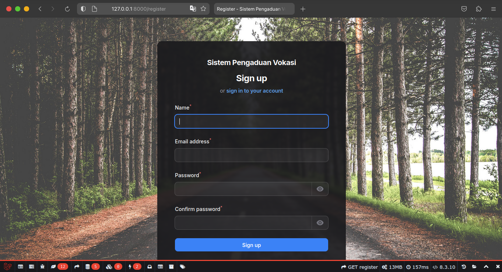
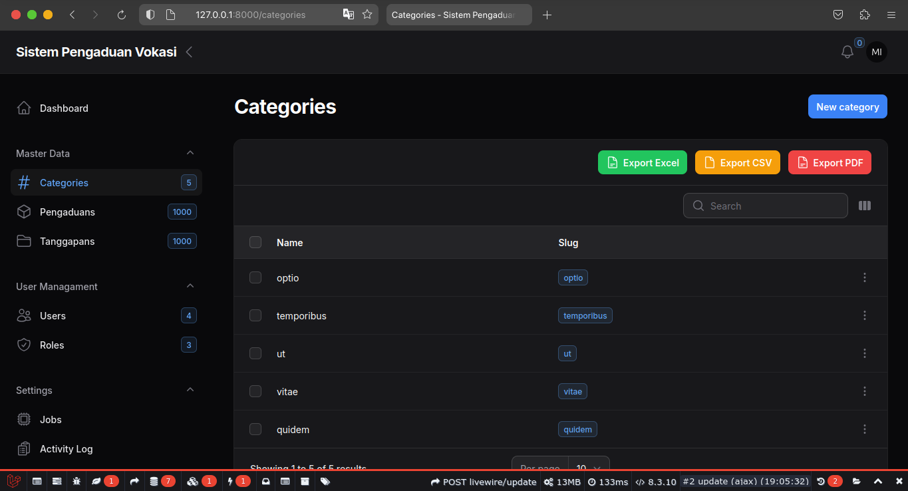
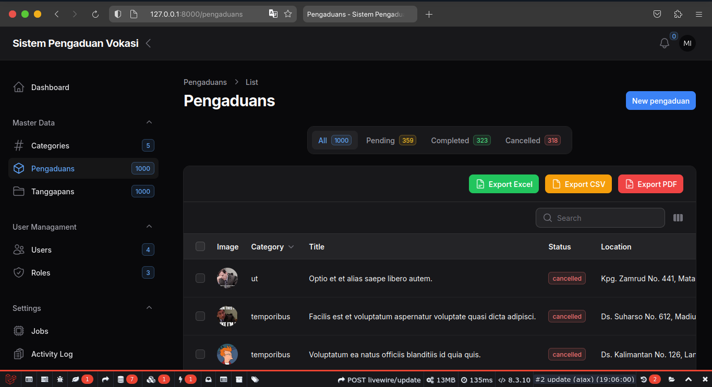
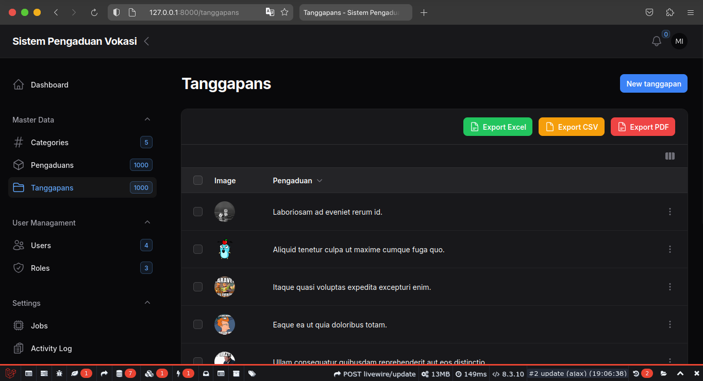
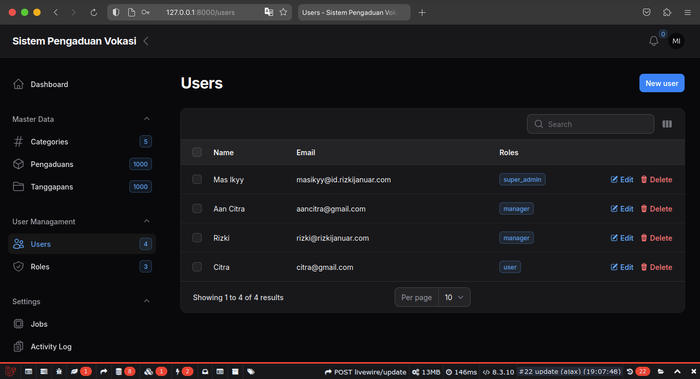

# Sistem Informasi Pengaduan Vokasi

> SIPEVO

----

## Daftar Isi
- [SIPEVO](#sistem-informasi-pengaduan-vokasi)
- [Daftar Isi](#daftar-isi)
- [Fitur](#fitur)
- [TODO Tasks](#todo-tasks)
- [Stacks](#stacks)
- [Build Setup](#build-setup)
- [License](#license)

## Fitur
- Login

- Register

- Dashboard

- Categories

- Pengaduan

- Tanggapan

- User Managament

- Export & Import PDF, Excel, CSV

## Build Setup
1. git clone `https://github.com/rizkijanuarr/sipevo-filament.git`
2. cp .env.example .env
3. Set up and create database local
4. `php artisan key:generate`
5. `php artisan migrate:refresh --seed`
6. `php artisan shield:install`
    > Jika ada pertanyaaan pilih yes semua dan pilih yang user Mas Ikyy, Anda mungkin bertanya passwordnya apa. Bisa dicek di  `/database/seeder/UserSeeder`
7. Sekarang, silakan start dev server Anda dengan menjalankan perintah serve seperti `php artisan serve`
    > Jika Anda menggunakan herd, Anda bisa langsung buka di browser http://sipevo-filament.test

## Stacks
- PHP 8.3
- Laravel 11
- Laravel Blueprint
- Filament 3-2
- Filament Progressbar
- Filament Backgrounds
- Filament Slim Scroll Bar
- Filament Logger
- Filament Jobs Monitor
- Filament Tutorial by Guaza
- Filament Shield
- Laravel Debugbar

## TODO Tasks
- [x] CRUD Categories
- [x] CRUD Pengaduan
- [x] CRUD Tanggapan
- [x] CRUD Users
- [x] Export Excel, CSV, PDF
- [ ] Import use CSV
- [ ] Query on summary total Pengaduan use widgets
- [ ] Jobs Quee Monitor not Work
- [ ] API For consume on Mobile Apps

## License

MIT © [Rizki Januar Irmansyah](https://github.com/rizkijanuarr/sipevo-filament)
