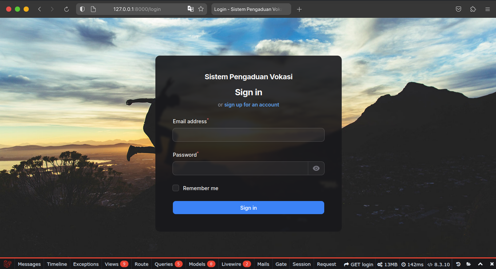

# Sistem Informasi Pengaduan Vokasi

> SIPEVO

----

## Daftar Isi
- [SIPEVO](#sistem-informasi-pengaduan-vokasi)
- [Daftar Isi](#daftar-isi)
- [Fitur](#fitur)
- [TODO Tasks](#todo-tasks)
- [Stacks](#stacks)
- [Build Setup](#build-setup)
- [License](#license)

## Fitur
- Login

- Register
- Dashboard
- Categories
- Pengaduan
- Tanggapan
- User Managament
- Settings
- Notifications
- Export & Import PDF, Excel, CSV

## Build Setup

## Stacks
- PHP 8.3
- Laravel 11
- Laravel Blueprint
- Filament 3-2
- Filament Progressbar
- Filament Backgrounds
- Filament Slim Scroll Bar
- Filament Logger
- Filament Jobs Monitor
- Filament Tutorial by Guaza
- Filament Shield
- Laravel Debugbar

## TODO Tasks

---
## License

MIT © [Rizki Januar Irmansyah](https://github.com/rizkijanuarr)
